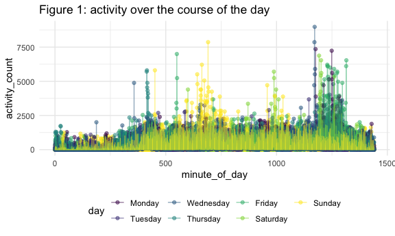

P8105 HW3
================
Wenbo Fei
10/10/2020

# Problem 1

``` r
data("instacart")
```

This dataset contains 1384617 rows and 15 columns. Each observation is
an item specific record. There are user / order variables – user ID,
order ID, order day, and order hour. There are also item variables –
name, aisle, department, and some numeric codes. For example, the first
order record shows that in order1 made by user112108 at 10:00 on the
forth day of a week after 9 days of his last purchase while this is his
4th order, a product “Bulgarian Yogurt” with ID 49302 is bought; this is
an reodered item and it was the first one to be added in his cart; it
belongs to dairy eggs department(16) on the yogurt aisle(120).

``` r
instacart %>% 
    count(aisle) %>% 
    arrange(desc(n))
```

    ## # A tibble: 134 x 2
    ##    aisle                              n
    ##    <chr>                          <int>
    ##  1 fresh vegetables              150609
    ##  2 fresh fruits                  150473
    ##  3 packaged vegetables fruits     78493
    ##  4 yogurt                         55240
    ##  5 packaged cheese                41699
    ##  6 water seltzer sparkling water  36617
    ##  7 milk                           32644
    ##  8 chips pretzels                 31269
    ##  9 soy lactosefree                26240
    ## 10 bread                          23635
    ## # … with 124 more rows

There are 134 aisles, and fresh vegetables are the most items ordered
from.

Let’s see the plot about number of items ordered in each aisle.

``` r
instacart %>% 
    count(aisle) %>% 
    filter(n > 10000) %>% 
    mutate(
        aisle = factor(aisle),
        aisle = fct_reorder(aisle, n)
    ) %>% 
    ggplot(aes(x = aisle, y = n)) + 
    geom_point() + 
    theme(axis.text.x = element_text(angle = 90, vjust = 0.5, hjust = 1)) +
  labs( y = "number of items ordered")
```


Let’s see a table showing the three most popular items in each of the
aisles “baking ingredients”, “dog food care”, and “packaged vegetables
fruits”.

``` r
instacart %>% 
    filter(aisle %in% c("baking ingredients", "dog food care", "packaged vegetables fruits")) %>% 
    group_by(aisle) %>% 
    count(product_name) %>% 
    mutate(rank = min_rank(desc(n))) %>% 
    filter(rank < 4) %>% 
    arrange(aisle, rank) %>% 
    knitr::kable()
```

| aisle                      | product\_name                                 |    n | rank |
| :------------------------- | :-------------------------------------------- | ---: | ---: |
| baking ingredients         | Light Brown Sugar                             |  499 |    1 |
| baking ingredients         | Pure Baking Soda                              |  387 |    2 |
| baking ingredients         | Cane Sugar                                    |  336 |    3 |
| dog food care              | Snack Sticks Chicken & Rice Recipe Dog Treats |   30 |    1 |
| dog food care              | Organix Chicken & Brown Rice Recipe           |   28 |    2 |
| dog food care              | Small Dog Biscuits                            |   26 |    3 |
| packaged vegetables fruits | Organic Baby Spinach                          | 9784 |    1 |
| packaged vegetables fruits | Organic Raspberries                           | 5546 |    2 |
| packaged vegetables fruits | Organic Blueberries                           | 4966 |    3 |

Let’s see a table showing the mean hour of the day at which Pink Lady
Apples and Coffee Ice Cream are ordered on each day of the week.

``` r
instacart %>% 
    filter(product_name %in% c("Pink Lady Apples", "Coffee Ice Cream")) %>% 
    group_by(product_name, order_dow) %>% 
    summarize(mean_hour = mean(order_hour_of_day)) %>% 
    pivot_wider(
        names_from = order_dow,
        values_from = mean_hour
    )
```

    ## `summarise()` regrouping output by 'product_name' (override with `.groups` argument)

    ## # A tibble: 2 x 8
    ## # Groups:   product_name [2]
    ##   product_name       `0`   `1`   `2`   `3`   `4`   `5`   `6`
    ##   <chr>            <dbl> <dbl> <dbl> <dbl> <dbl> <dbl> <dbl>
    ## 1 Coffee Ice Cream  13.8  14.3  15.4  15.3  15.2  12.3  13.8
    ## 2 Pink Lady Apples  13.4  11.4  11.7  14.2  11.6  12.8  11.9

# Problem 2

``` r
accel_data = 
  read_csv("./data/accel_data.csv") %>%
  janitor::clean_names() %>%
  pivot_longer(
    activity_1:activity_1440,
    names_to = "minute_of_day",
    names_prefix = "activity_",
    values_to = "activity_count" ) %>%
    mutate( weekend = ifelse(day %in% c("Saturday","Sunday"), 1, 0),
            day = forcats::fct_relevel(day, c("Monday", "Tuesday", "Wednesday", "Thursday", "Friday", "Saturday", "Sunday"))) %>%
  mutate_at(vars(week:day_id), as.factor) %>%
  mutate_at("minute_of_day", as.integer) %>%
  mutate_at("weekend", as.logical) 
  
head(accel_data)
```

    ## # A tibble: 6 x 6
    ##   week  day_id day    minute_of_day activity_count weekend
    ##   <fct> <fct>  <fct>          <int>          <dbl> <lgl>  
    ## 1 1     1      Friday             1           88.4 FALSE  
    ## 2 1     1      Friday             2           82.2 FALSE  
    ## 3 1     1      Friday             3           64.4 FALSE  
    ## 4 1     1      Friday             4           70.0 FALSE  
    ## 5 1     1      Friday             5           75.0 FALSE  
    ## 6 1     1      Friday             6           66.3 FALSE

Our final dataset includes 50400 observations with 6 variables. Each
observation has a “week” variable indicating which week, a
unique“day\_id” variable for each specific day, a “day” variable
indicating the day of the week, a “minute\_of\_day” variable indicating
which minute of the day is the record about, a “activity\_court”
recoding the activity counts for the minute, and a “weekend” indicating
whether it’s a weekend or a weekday.

Let’s see a table showing daily total activity.

``` r
accel_data %>%
  group_by(day_id) %>%
  summarize(total_activity = sum(activity_count)) %>%
  knitr::kable()
```

    ## `summarise()` ungrouping output (override with `.groups` argument)

| day\_id | total\_activity |
| :------ | --------------: |
| 1       |       480542.62 |
| 2       |        78828.07 |
| 3       |       376254.00 |
| 4       |       631105.00 |
| 5       |       355923.64 |
| 6       |       307094.24 |
| 7       |       340115.01 |
| 8       |       568839.00 |
| 9       |       295431.00 |
| 10      |       607175.00 |
| 11      |       422018.00 |
| 12      |       474048.00 |
| 13      |       423245.00 |
| 14      |       440962.00 |
| 15      |       467420.00 |
| 16      |       685910.00 |
| 17      |       382928.00 |
| 18      |       467052.00 |
| 19      |       371230.00 |
| 20      |       381507.00 |
| 21      |       468869.00 |
| 22      |       154049.00 |
| 23      |       409450.00 |
| 24      |         1440.00 |
| 25      |       260617.00 |
| 26      |       340291.00 |
| 27      |       319568.00 |
| 28      |       434460.00 |
| 29      |       620860.00 |
| 30      |       389080.00 |
| 31      |         1440.00 |
| 32      |       138421.00 |
| 33      |       549658.00 |
| 34      |       367824.00 |
| 35      |       445366.00 |

I can’t see any apparent increasing or decreasing trend from this table.
Looks like except for 3 days, all the other days have same order of
magnitude of total activity count with fluctuation. We may need further
analysis and visulization to find systematic trend.

Let’s see a plot on activity over the course of the day, while each line
represents a day and each color represent a specific day in a week.

``` r
accel_data %>%
  group_by(day_id) %>%
  ggplot(aes(x = minute_of_day, y = activity_count, color = day)) + 
    geom_point(alpha = .5) + geom_line(alpha = .5) + 
    theme(legend.position = "bottom") +
  labs(title = "Figure 1: activity over the course of the day")
```



There activity over the course of the day varies for different time in a
day and different day in a week. From around 350 minutes, the person
maintain a moderate activity count, compared to 270 minutes in weekdays,
which might mean that he gets up earlier in weekdays than weekend. The
peak of activity on weekend are between 600-750 minutes, around 1000
minutes and some 1200 minutes, while the major peak for weekdays are
around 1250 minutes, some around 500 minutes, this may indicate that the
person do exercises in different time of a day.

# Problem 3

``` r
data("ny_noaa")
```

These data were accessed from the NOAA National Climatic Data Center
containing weather information for all New York state weather stations
from 1981 to 2010. It contains 2595176 observations and 7 variables,
while “id” represents weather station ID, “date” represents date of
observation, “prcp” represents precipitation (tenths of mm), “snow”
represents snowfall (mm),“snwd” represents snow depth (mm), “tmax”
maximum temperature (tenths of degrees C), “tmin” minimum temperature
(tenths of degrees C). Each weather station may collect only a subset of
these variables, and therefore the resulting dataset contains extensive
missing data. Of all observations, 52.9% contain at least one missing
value. In addition, 2.8% have missing values for all five key variables,
and for this proportion, we nearly get nothing from this data.

``` r
noaa_data <- ny_noaa %>% 
  janitor::clean_names() %>% 
  separate(date, c("year", "month", "day"), sep = "-") %>% 
  mutate(tmax = as.double(tmax) / 10, 
         tmin = as.double(tmin) / 10, 
         prcp = prcp / 10,
         month = month.name[as.integer(month)], 
         year = as.integer(year))

quantile(pull(noaa_data, snow), na.rm = T)
```

    ##    0%   25%   50%   75%  100% 
    ##   -13     0     0     0 10160

``` r
sum(pull(noaa_data, snow)<0, na.rm = T)
```

    ## [1] 1

From the quantile, we can see that at least over 50% of snowfall data
are 0, so 0 is the most commonly observed values. This is reasonable as
we know that NY usually have snow in winter season while no snow in
other 3 seasons. However, there’s a negative snowfall, which might be a
mistake.

Let’s see a two-panel plot showing the average max temperature in
January and in July in each station across years. Each point represents
average tmax over the month in the year in specific station.

``` r
noaa_data %>% 
  filter(month %in% c("January", "July")) %>% 
  group_by(year, month, id) %>% 
  summarize(avg_temp = mean(tmax, na.rm = TRUE)) %>% 
  drop_na() %>%
  ggplot(aes(x = year, y = avg_temp)) + 
  geom_point(alpha = 0.3) + 
  geom_smooth(se = F) +
  facet_grid(~ month) + 
  labs(title = "Figure 2: Average maximum temperature (°C) in January and July, 1981-2010", 
       x = "Year", 
       y = "Average Max Daily Temperature (°C)") 
```


There’s an continuous increase for the average max temperature in
January from 1980-1990, and then it tends to flutuate around zero
degrees while the temperature for July varies around 27 degrees. In
addition, the average maximum temperature for January appears to have
more variation compared to that of July. Looks like there is one station
has much lower average tmax(10 degress than the min of all the other
station, and nearly 15 degrees from the center) in July 1988, we need to
further check the data and other information to determine whether it’s
an outlier.

Let’s see a two-panel plot showing (i) tmax vs tmin for the full
dataset. For this plot, since there are too many data points, we use a
heatmap. (ii) the distribution of snowfall values greater than 0 and
less than 100 separately by year.

``` r
library(plotly) #for hexbin()
library(patchwork) #for wrap_elements()
temp_hex <- noaa_data %>%
  ggplot(aes(x = tmin, y = tmax)) +
    geom_hex() + 
    theme(legend.position = "bottom",
          legend.key.height = unit(0.1, "in"),
          legend.key.width = unit(0.4, "in")) +
    labs(title = "Heatmap of daily tmax vs. tmin",
         x = "tmin (°C)", 
         y = "tmax (°C)") 

snow_density <- noaa_data %>%
  filter(snow > 0 & snow < 100) %>%
  mutate(year = as.factor(year)) %>%
  ggplot(aes(x = snow, color = year)) +
  geom_density(alpha = 0.01) +
  labs(title = "Density plot of snowfall(mm)",
         x = "Snowfall (mm)", 
         y = "Density") + 
  theme(legend.key.size = unit(0.05, "in"))

final_plot <- temp_hex + snow_density 

wrap_elements(final_plot) + ggtitle("Figure 3: Heatmap and density plots")
```

    ## Warning: Removed 1136276 rows containing non-finite values (stat_binhex).


From the heatmap, the lighter the color means the higher density, it’s
obvious that there is positive linear relationship between tmin and
tmax.

From the density plot, it can be seen that there are local maximum in
density around 20, 25, 50, and 75 mm. One can also notice that the
heights of later 25, 50, 75 peaks has decreased over each the years –
the lighter the color, the lower the peak. This might indicate the
result of climate change resulting in less snowfall.
